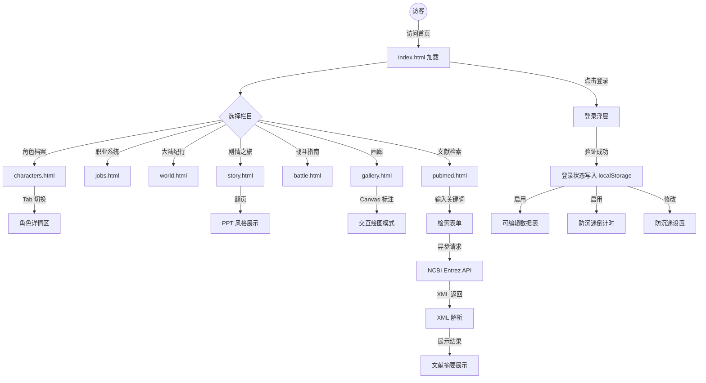
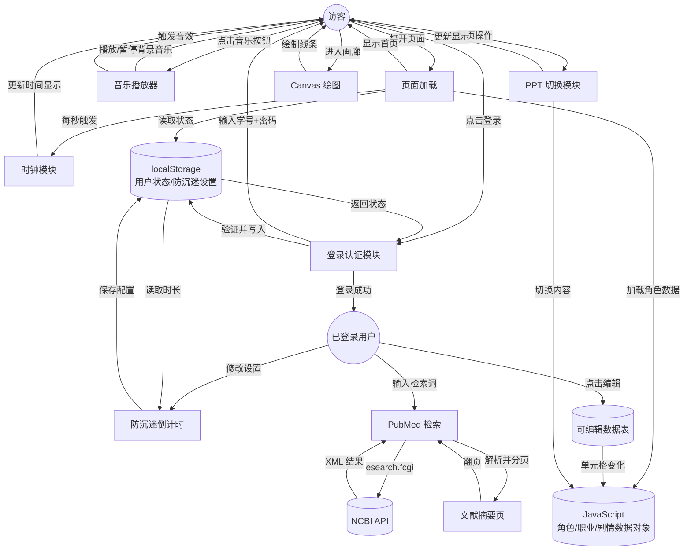
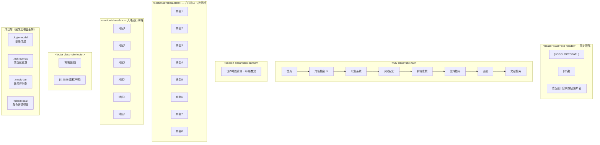
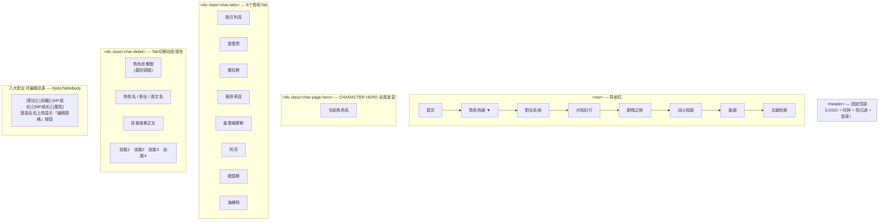
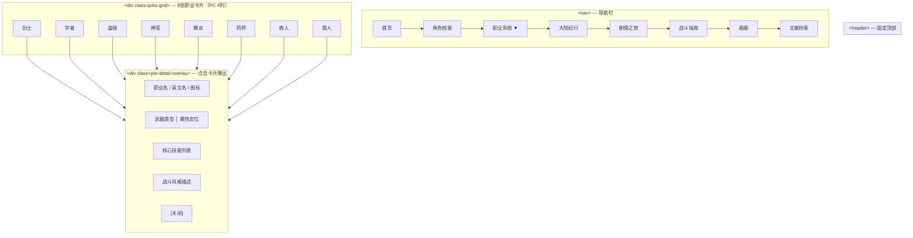
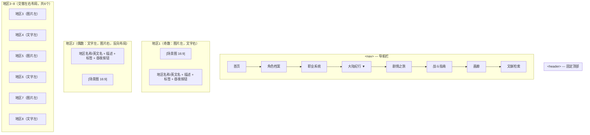
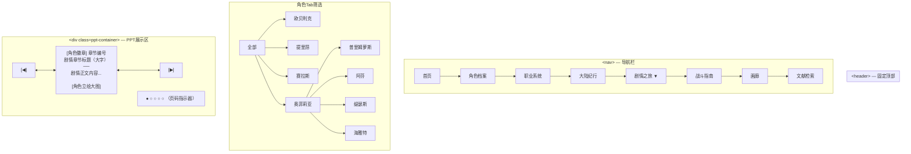
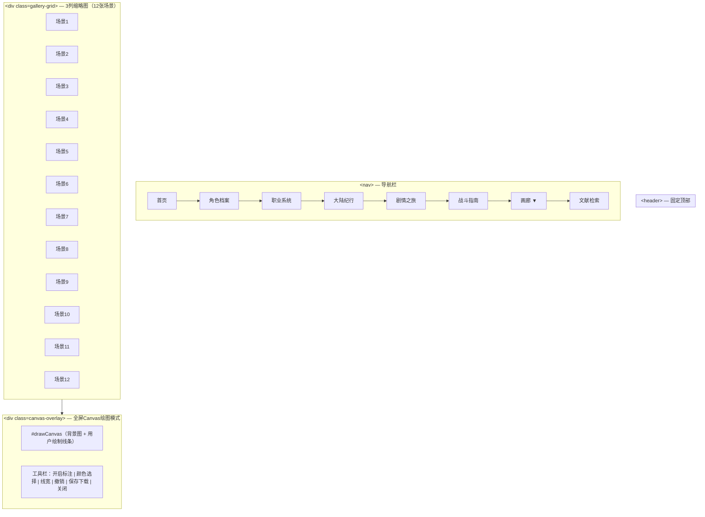
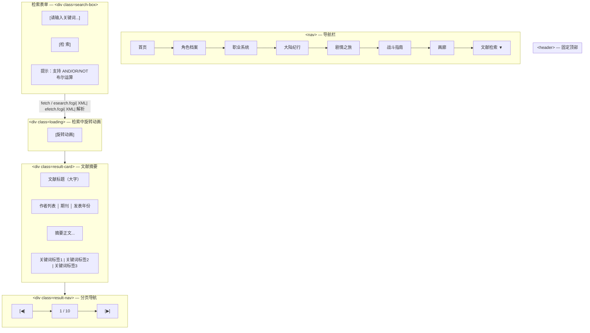

```mermaid
flowchart TB
    subgraph header["&lt;header&gt; — 固定顶部"]
    end
    subgraph nav["&lt;nav&gt; — 导航栏"]
        N1["首页"] --> N2["角色档案"] --> N3["职业系统"] --> N4["大陆纪行"]
        N4 --> N5["剧情之旅"] --> N6["战斗指南 ▼"] --> N7["画廊"] --> N8["文献检索"]
    end

    subgraph shield["弱点破盾系统 — &lt;div class=battle-section&gt;"]
        S1["弱点击破"] --> S2["护盾碎裂"] --> S3["Break触发"]
    end

    subgraph bp["BP Boost 系统 — &lt;div class=battle-section&gt;"]
        B1["BP 1"] --> B2["BP 2"] --> B3["BP 3"] --> B4["... → max 9 BP"]
    end

    subgraph synergy["职业协同 — &lt;div class=battle-section&gt;"]
        SY["多职业技能组合搭配策略"]
    end
```

# 八方旅人 Octopath Traveler 主题网站开发文档

## 内容简介

本网站以 Square Enix 经典 JRPG《八方旅人》（Octopath Traveler）为核心主题，采用其标志性的"HD-2D"美术风格（16-bit 像素角色叠加 3D 等距场景），打造一个沉浸式的游戏介绍与互动平台。

网站围绕八位旅人的角色档案、职业系统、奥鲁斯特拉大陆世界观、剧情章节与战斗机制六大栏目展开，融入良好的交互动效与背景音乐设计，让访客仿佛置身于那个蒸汽与魔法并存的新时代大陆。

### 主要功能与栏目

| 栏目 | 说明 |
|------|------|
| 首页 | HD-2D 风格主视觉横幅 + 八位旅人入口卡片 + 大陆纪行预览 + 背景音乐开关 |
| 角色档案 | 八位旅人 Tab 切换（背景故事 + 职业 + 地图指令 + 战斗技能）+ 八大职业可编辑总表 |
| 职业系统 | 剑士/学者/盗贼/神官/舞女/药师/商人/猎人 八大基础职业详解（卡片式 + 详情浮层） |
| 大陆纪行 | 奥鲁斯特拉大陆八大地区介绍（昼夜切换真实场景图） |
| 剧情之旅 | 八位旅人章节剧情 PPT 翻页展示（支持键盘/触摸 + 真实角色立绘） |
| 战斗指南 | 回合制战斗机制 + 弱点破盾系统 + BP boost + 职业协同解析 |
| 画廊 | 游戏 HD-2D 场景截图展示（Canvas 交互式绘图标注 + 颜色/线宽可调） |
| 文献检索 | PubMed Entrez 异步检索（NCBI API + XML 解析 + 键盘翻页） |

---

## 需求分析

**Q1：本网站的目标用户是谁？**

A1：主要面向《八方旅人》系列游戏的粉丝、JRPG 爱好者，以及对 HD-2D 美术风格感兴趣的游戏玩家。大学生用户在完成 Web 编程大作业的同时，展示对游戏文化的理解。

**Q2：网站的核心吸引力在哪里？**

A2：HD-2D 视觉风格的还原——通过暖棕金色调模拟八方旅人的古典质感；八位旅人各具特色的角色魅力；白天/黑夜交替的场景氛围切换；以及与游戏音乐融合的背景音效层。
**Q3：网站实现了哪些基本功能？**

A3：网站共实现了 11 项核心功能：

1. 独立 .css 样式文件（响应式布局，适配 PC / 平板 / 手机）
2. 独立 .js 交互文件（所有页面共享同一份逻辑）
3. 电子邮件超链接（footer 邮箱链接）
4. 模拟登录（localStorage + SHA-256 加密）
5. 防沉迷倒计时（localStorage 配置，30 分钟提醒 → 10 分钟锁定）
6. 时钟功能（header 每秒刷新 hh:mm:ss）
7. 可编辑数据表（登录后在角色档案页编辑职业数据）
8. 类 PPT 页面切换（剧情之旅页，支持键盘 ← → / 触摸滑动）
9. 原生 Canvas 交互式绘图（画廊页，6 色 + 线宽 + 橡皮擦 + 撤销 + 保存）
10. PubMed Entrez 检索（剧情文献页，异步 fetch + XML 解析 + 键盘翻页）
11. 背景音乐层 + 音效层（底部控制条，状态写入 localStorage）

**Q4：音乐交互设计如何实现？**

A4：采用"背景音乐层 + 音效层"双轨方案。背景音乐为游戏主旋律（OPBGM）的改编版，音效层在用户进行关键交互（点击卡片、切换页面）时触发短音效。两者均可独立开关，状态保存至 localStorage。（注：音频文件因版权原因需用户自行添加，当前界面与控制逻辑已完整实现。）

**Q5：设计风格是怎样的？**

A5：采用八方旅人游戏本体的暖棕金色调——主背景 `#1a1410`（暖调棕黑）、强调色 `#c9a227`（古典金）、辅助色 `#c9a22780`（半透明金），整体营造古典 JRPG 的厚重质感。搭配 Georgia/Palatino 衬线字体、卡片四角古典角框装饰、菱形宝石分割线等元素，与游戏内 UI 风格一致。

**Q6：数据库是否需要？**

A6：本次开发采用纯前端方案（无后端数据库）。所有数据以 JavaScript 对象形式维护在内存中，localStorage 仅用于存储用户登录状态和防沉迷设置。

---

## 开发环境

### 服务器端

| 软件 | 版本 | 说明 |
|------|------|------|
| Python http.server | 内置 | 用于本地开发预览（`python -m http.server 8080`） |
| Node.js | v20.x LTS | 可选：用于 LiveServer 等开发工具 |
| VS Code | 最新版 | 推荐编辑器，支持 Live Preview 扩展 |

### 客户端配置

| 软件 | 版本 |
|------|------|
| Google Chrome | 120+ |
| Microsoft Edge | 120+ |
| Firefox | 120+ |
| Safari | 16+ |
| Windows 10/11 | 最新更新 |

### Web 运行环境

纯前端静态网站，无需服务器端环境，直接打开 `index.html` 即可运行。支持所有主流现代浏览器。

### 编程语言

| 语言 | 版本 | 用途 |
|------|------|------|
| HTML5 | - | 页面结构 |
| CSS3 | - | 样式与动画（含 Flexbox、Grid、变量、动画） |
| JavaScript | ES6+ (ES2022) | 交互逻辑、API 调用、Canvas 绘图 |
| Markdown | - | 开发文档撰写 |

### AI 工具

| 工具 | 版本/来源 | 用途 |
|------|---------|------|
| MiniMax M2 | 内置 | 文档生成与代码辅助 |
| Claude Code | CLI | 复杂代码片段生成与审查 |
| Codex CLI | 0.130.0 | 代码辅助 |

### 命名规则

| 类型 | 规则 | 示例 |
|------|------|------|
| HTML 文件 | kebab-case | `index.html`, `characters.html` |
| CSS 类名 | BEM 风格 | `header__logo`, `char-card__name` |
| JavaScript 函数 | camelCase | `initClock()`, `switchChar()` |
| 常量 | UPPER_SNAKE_CASE | `DEFAULT_RETMAX` |
| 变量 | camelCase | `currentSlide`, `isLoggedIn` |

---

## 数据库表设计

本项目为纯前端静态网站，不涉及任何后端数据库。所有数据（角色信息、职业数据、剧情内容等）均以 JavaScript 对象形式维护在各页面 `<script>` 标签内，页面间无数据传递需求。

用户登录状态与防沉迷设置通过浏览器 `localStorage` 实现持久化，不依赖服务端数据库：

| 存储项 | 键名 | 说明 |
|--------|------|------|
| 登录信息 | `octopath_user` | JSON 对象，结构为 `{studentId: "学号"}` |
| 防沉迷时长 | `octopath_countdown` | 剩余秒数（整数） |

---

## 总体框架

### 方案简介

本项目以多页面架构为主，通过标准超链接在 8 个页面间跳转。各页面独立运行，部分共享 header/footer 结构（通过直接复制实现，非 SSR 组件）。

整体风格采用八方旅人游戏本体的暖棕金色调，营造古典 JRPG 的厚重沉浸感，与 HD-2D 美术风格相呼应。

### 功能流图



### 数据流图



### 目录结构

```
八方旅人网站/
│
├── index.html                  # 网站首页（主入口）
│                                 # 含：英雄横幅 + 角色卡片网格 + 大陆纪行区
│
├── css/
│   └── style.css               # 全局样式（八方旅人暖棕金配色）
│                                 # 含：CSS 变量、暗色主题、网格布局、卡片样式、动画
├── js/
│   └── main.js                 # 主入口（时钟 + 防沉迷 + 登录弹窗 + 音乐控制）
│                                 # 所有页面共享同一份逻辑
├── 图集/                        # 35 张真实图片
│   ├── olberic.png             # 剑士立绘
│   ├── therion.jpg             # 盗贼立绘
│   ├── haanit.png              # 猎人立绘
│   ├── primrose.png            # 舞女立绘
│   ├── cyrus.png               # 学者立绘
│   ├── ophilia.png             # 神官立绘
│   ├── alfyn.png               # 药师立绘
│   ├── tressa.png              # 商人立绘
│   ├── hero_bg.png             # 英雄区背景（世界地图）
│   ├── highres_map.png         # 高清世界地图
│   ├── battle1.png             # 战斗场景
│   ├── snow1.png ~ forest1.png # 八大地区场景图（8张）
│   └── inn1.png / library1.png # 旅馆 / 图书馆场景
│
├── pages/                      # 子页面目录
│   ├── characters.html          # 角色档案页（Tab 切换 + 可编辑职业总表）
│   ├── jobs.html               # 职业系统页（8 职业卡片 + 详情浮层）
│   ├── world.html              # 大陆纪行页（昼夜切换 8 地区）
│   ├── story.html              # 剧情之旅页（PPT 翻页 + 角色立绘）
│   ├── battle.html             # 战斗指南页（弱点/BP/职业协同）
│   ├── gallery.html            # 画廊页（12 场景图 + Canvas 标注）
│   └── pubmed.html             # PubMed 文献检索页（NCBI API）
│
└── 开发文档.md                   # 本文档
```

---

## 详细设计

### 全局样式（css/style.css）

- **CSS 变量（核心配色）**：
  - `--color-bg: #1a1410` — 暖调棕黑主背景
  - `--color-bg-secondary: #241c16` — 次级背景
  - `--color-bg-card: #2a2218` — 卡片背景
  - `--color-gem: #c9a227` — 古典金色（主强调色）
  - `--gradient-primary: linear-gradient(135deg, #c9a227, #a8851e)` — 金色渐变
  - `--color-hover: #4d9fff` — 链接/交互高亮蓝
  - `--color-border: rgba(201,162,39,0.2)` — 金色半透明边框
  - `--border-radius: 12px` — 卡片圆角
- **字体**：Georgia / Palatino / serif 为主，Impact / sans-serif 用于标题
- **卡片四角装饰**：Hover 时显示古典金色角框（`::before` / `::after` 伪元素）
- **Section 标题**：居中 + 菱形宝石分割线装饰
- **响应式**：CSS Grid + Flexbox，PC 4列 → 平板 2列 → 手机 1列

### 首页（index.html）

#### 布局结构（原文）

```
<body>
  <header class="site-header">          <!-- 固定顶部：logo + 时钟 + 倒计时 + 登录 -->
  <nav class="site-nav">                <!-- 二级下拉导航栏 -->
  <main class="site-main">
    <section class="hero-banner">       <!-- 全宽英雄横幅：背景图 + 标题叠加 -->
    <section class="section" id="characters">  <!-- 八位旅人卡片网格 -->
    <section class="section" id="world">       <!-- 八大陆纪行卡片网格 -->
  </main>
  <footer class="site-footer">          <!-- 邮箱链接 + 版权声明 -->
  <div class="music-bar">...</div>      <!-- 音乐控制条 -->
  <div class="login-modal">...</div>     <!-- 登录浮动窗口 -->
  <div class="lock-overlay">...</div>    <!-- 防沉迷锁定遮罩 -->
  <div class="login-modal" id="charModal">...</div>  <!-- 角色详情弹窗 -->
  <script src="js/main.js">...</script>
</body>
```

#### 布局结构（Mermaid 流程图）



#### 英雄横幅

- 实现方式：`div.hero-bg` + `background-image: url('图集/hero_bg.png')`（世界地图）
- 覆盖层：`div.hero-overlay` + 渐变遮罩 + 标题文字
- 无 Canvas，纯 CSS + 图片

#### 角色卡片网格

- 8 列网格（PC），Hover 时四角显示金色古典角框装饰
- 每张卡片使用真实角色立绘（`图集/olberic.png` 等）

#### 交互事件（js/main.js）

| 事件 | 行为 |
|------|------|
| 页面加载完成 | 初始化时钟、读取 localStorage 恢复防沉迷状态 |
| 时钟区域 | 每秒更新 `hh:mm:ss` 格式时间 |
| 防沉迷倒计时 | 每秒减少，未登录则不启动；归零时弹出锁定窗口，10 分钟后解锁 |
| 点击登录按钮 | 弹出居中浮动登录窗口（带 SHA-256 加密验证） |
| 登录成功 | 隐藏登录按钮，显示用户名；同时解锁可编辑数据表 |
| 音乐按钮点击 | 切换背景音乐播放/暂停 |
| 角色卡片点击 | 弹出角色详情 Modal |

---

### 角色档案页（pages/characters.html）

#### 布局结构（原文）

```
<main>
  <div class="char-tabs">          <!-- 8 个角色 Tab，横向排列，胶囊按钮 -->
  <div class="char-detail">        <!-- 动态填充角色详情 -->
  <div class="section">            <!-- 八大职业可编辑总表 -->
</main>
```

#### 布局结构（Mermaid 流程图）



#### 数据与交互

- 角色数据以 JavaScript 对象（`charData`）内联于页面 `<script>` 中
- Tab 点击调用 `switchChar(id)` 切换角色详情
- 职业总表渲染于 `<tbody id="jobsTableBody">`，登录后右上角显示"编辑表格"按钮

#### 可编辑表格逻辑

- 未登录：编辑按钮隐藏
- 登录后点击"编辑表格"：所有 `<td>` 设置 `contentEditable = true`
- 再次点击"保存退出"：恢复 `contentEditable = false`

---

### 职业系统页（pages/jobs.html）

#### 布局结构（原文）

- 8 张职业卡片（`jobs-grid`），点击弹出详情浮层（`job-detail-overlay`）
- 职业数据（`JOBS` 数组）内联于页面 `<script>`
- 详情浮层展示：武器、属性、定位、核心技能

#### 布局结构（Mermaid 流程图）



---

### 大陆纪行页（pages/world.html）

#### 布局结构（原文）

- 8 个地区条目，左右交替布局（`nth-child(even) { direction:rtl }`）
- 每个地区含一张场景图片（`图集/snow1.png` 等），点击"昼/夜"按钮切换叠加层
- 昼夜切换：夜间叠加半透明黑色遮罩（`nightOverlay.style.display = 'block'`）

#### 布局结构（Mermaid 流程图）



---

### 剧情之旅页（pages/story.html）

#### PPT 翻页模块（原文）

| 功能 | 说明 |
|------|------|
| PC 端翻页 | 点击左右箭头图标 或按 `←` `→` 键翻页 |
| 移动端翻页 | 左右滑动触摸翻页（`touchstart` / `touchend`） |
| 进度指示 | 底部圆点指示器，显示当前页码 |
| 章节切换 | 顶部角色 Tab 筛选不同旅人的章节 |
| 动画效果 | 翻页时内容淡入淡出（400ms ease） |

- 每角色 4 章剧情，共 32 张 PPT 页面
- 每张 PPT 使用真实角色立绘作为配图（`图集/${currentChar}.png`）

#### 布局结构（Mermaid 流程图）



---

### 战斗指南页（pages/battle.html）

#### 布局结构（原文）

- 以图文说明回合制战斗机制（弱点破盾、BP boost、职业协同）
- 纯静态内容，无外部图片依赖

#### 布局结构（Mermaid 流程图）



---

### 画廊页（pages/gallery.html）

#### Canvas 交互式标注（原文）

| 功能 | 说明 |
|------|------|
| 图片选择 | 点击缩略图进入全尺寸 Canvas 绘图模式 |
| 绘图模式开关 | 点击"开启标注"按钮显示工具栏 |
| 绘图工具 | 6 种颜色（#c9a227/#ff4444/#4d9fff/#4dff4d/#ffffff/#9b6dff）、线宽 1-12px、橡皮擦、撤销 |
| 触摸支持 | 支持鼠标和触摸两种绘图方式 |
| 保存 | `canvas.toDataURL('image/png')` 下载标注结果 |

- 背景图片加载：失败时显示渐变占位背景

#### 布局结构（Mermaid 流程图）



---

### PubMed 文献检索页（pages/pubmed.html）

#### 功能模块（原文）

| 功能 | 说明 |
|------|------|
| 检索表单 | 输入 PubMed 检索表达式 |
| 异步检索 | `fetch()` 调用 `esearch.fcgi` 获取 PMID 列表 |
| XML 解析 | JavaScript `DOMParser` 解析返回的 XML |
| 结果展示 | 每次显示 1 篇文献摘要（标题/作者/期刊/摘要/关键词） |
| 分页导航 | 翻页按钮 + `←` `→` 键翻页 |
| 加载状态 | 检索中显示 CSS 旋转加载动画 |

#### API 调用

```
GET https://eutils.ncbi.nlm.nih.gov/entrez/eutils/esearch.fcgi?db=pubmed&term=<关键词>&retmax=<数量>&retmode=xml
GET https://eutils.ncbi.nlm.nih.gov/entrez/eutils/efetch.fcgi?db=pubmed&id=<PMID列表>&retmode=xml
```

#### 布局结构（Mermaid 流程图）



---

## 实现要点

### CSS 变量体系（style.css 核心）

八方旅人风格的核心在于暖色调配色，所有颜色通过 CSS 变量统一管理：

```css
:root {
  --color-bg: #1a1410;              /* 暖调棕黑主背景 */
  --color-bg-secondary: #241c16;     /* 次级背景 */
  --color-bg-card: #2a2218;          /* 卡片背景 */
  --color-gem: #c9a227;              /* 古典金色 */
  --gradient-primary: linear-gradient(135deg, #c9a227, #a8851e);
  --color-hover: #4d9fff;           /* 交互高亮蓝 */
  --color-border: rgba(201,162,39,0.2);
  --color-text-primary: #e8d5b0;    /* 暖白色文字 */
  --color-text-secondary: #a89880;   /* 次级文字 */
  --color-text-muted: #6b5a40;      /* 弱化文字 */
  --border-radius: 12px;
  --header-height: 70px;
  --nav-height: 48px;
}
```

### 登录与 SHA-256 加密

- 使用 Web Crypto API：`crypto.subtle.digest('SHA-256', new TextEncoder().encode(password))`
- 验证：计算输入密码哈希，与存储的哈希比对
- 状态存储：`localStorage.setItem('octopath_logged_in', 'true')`

### 防沉迷倒计时

- 登录后启动，30 分钟倒计时，写入 `localStorage`
- 归零时全屏遮罩 `lock-overlay` 锁定 10 分钟
- 刷新页面可恢复剩余时间（从 localStorage 读取）

### 八大角色数据内联方案

各页面不依赖外部 JSON 文件，角色/职业/剧情数据直接以 JavaScript 对象定义在页面 `<script>` 标签内，简化部署复杂度：

```javascript
const charData = {
  olberic: { name:'欧贝利克', job:'剑士', bg:'...', skills:[...] },
  therion: { name:'提里昂', job:'盗贼', bg:'...', skills:[...] },
  // ...
};
```

---

## 参考资料

- 八方旅人中文维基：https://octopathtraveler.fandom.com/wiki/
- 课程要求 PDF：新版实验内容和要求-20260426.pdf
- 补充说明 TXT：补充要求.txt
- Markdown 语法参考：https://www.markdown.cn/
- Mermaid 文本绘图工具：https://mermaid.live/
- NCBI PubMed Entrez API：https://www.ncbi.nlm.nih.gov/home/develop/api/
